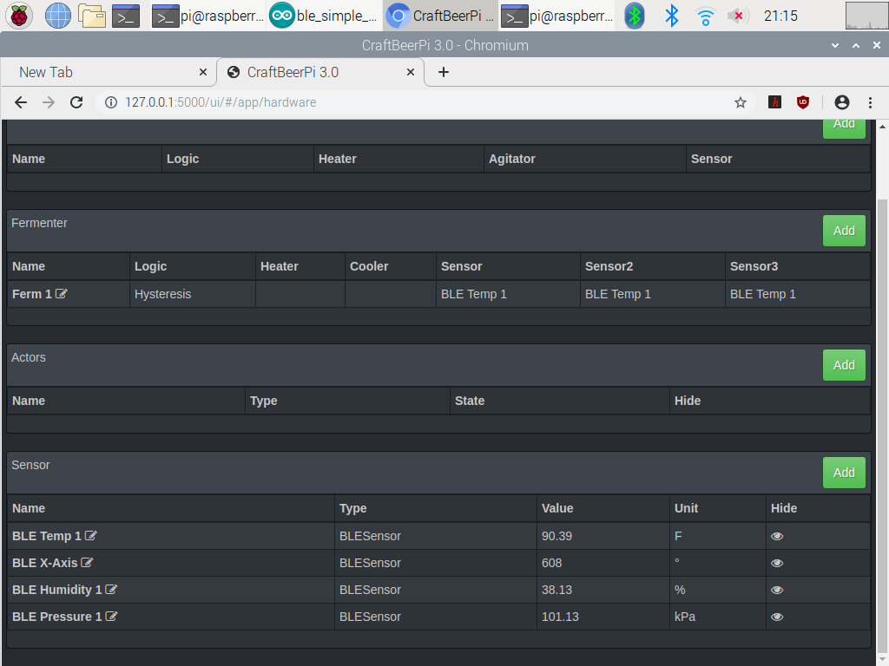
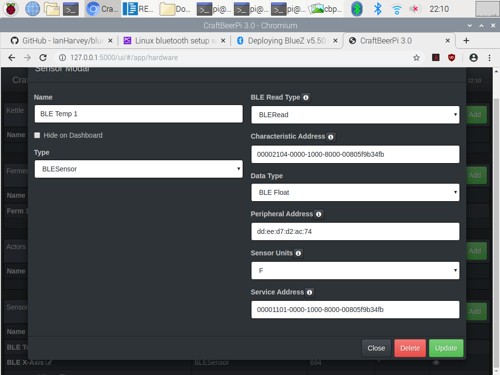

# craftbeerpi3arduinoBLE
Plugin for craftbeerpi3 that reads sensor input through Blue tooth light (BLE) from arduino device (nano 33 sense) or any device for BLE bluetooth. The plugin uncludes Arduino sketch that reads sensors for Temperature, Accelerometer, Pressure, and Humidity.

  Four sensors configured and reading values from Arduino nano 33 sense:
  

## Setup Rasberry Pi for Bluetooth BLE

 Need to install bluez to rpi. It might be 80% there to just do:

 > sudo apt-get install bluetooth bluez bluez-tools rfkill rfcomm

 some other resouces showing how to install from source.also more on dependencies and configuring bluetooth device on the Rasberry pi.
  Some files need to be modified to enable BLe (some of these resources may be old and so maybe not nessesary anymore)

[github.com/IanHarvey/bluepy](https://github.com/IanHarvey/bluepy)

[bluetooth.com/blog/bluez-on-raspberry-pi-update/](https://www.bluetooth.com/blog/bluez-on-raspberry-pi-update/)

[learn.adafruit.com/install-bluez-on-the-raspberry-pi/installation](https://learn.adafruit.com/install-bluez-on-the-raspberry-pi/installation)

## Setup Arduino To read sensors

Under directory arduino/simple_sensors is a sketch "ble_simple_sensors" that was developed on a Arduino nano 33 sense. Should be easy to modify for any Arduino to read sensor values and send over Blue Tooth Light to cbpi3 pluggin to read. 
You need the Arduino IDE that can be downloaded for free online and installed on any computer. I have it installed on a rasberry pi 4 and works pretty good; although, the compilation can take a long time sometimes.

 Once script is running on Arduino, run the ble_scanner.py file under pluggin main directory
 > sudo python ble_scanner.py

 Look for device with local name **Arduino Accelerometer** should look something like this

 `Device dd:ee:d7:d2:ac:74 (public), RSSI=-67 dB

  Flags = 06
  
  Incomplete 16b Services = 00001101-0000-1000-8000-00805f9b34fb

  Complete Local Name = Arduino Accelerometer`

## Setup Pluggin to read BLE sensor devices

The service name starts with `00001101-`and then the rest of the 16 bytes service name.
The Peripheral address above is`dd:ee:d7:d2:ac:74` but yours will be different (MAC idea of device)

### The Characteristic device names for each Arduino sensor in sketch provided

- 00002101- Accelerometer X-Axis
- 00002104- Temperature
- 00002105- Humidity
- 00002106- Barometeric Pressure

The read type choices "BLERead" and BLENotify". Recommend for now try using "BLERead" because it seems more stable. Notify is good when saving battery power for devices that only sends information out ocassionally.
\
This is example setup for Temperature probe

